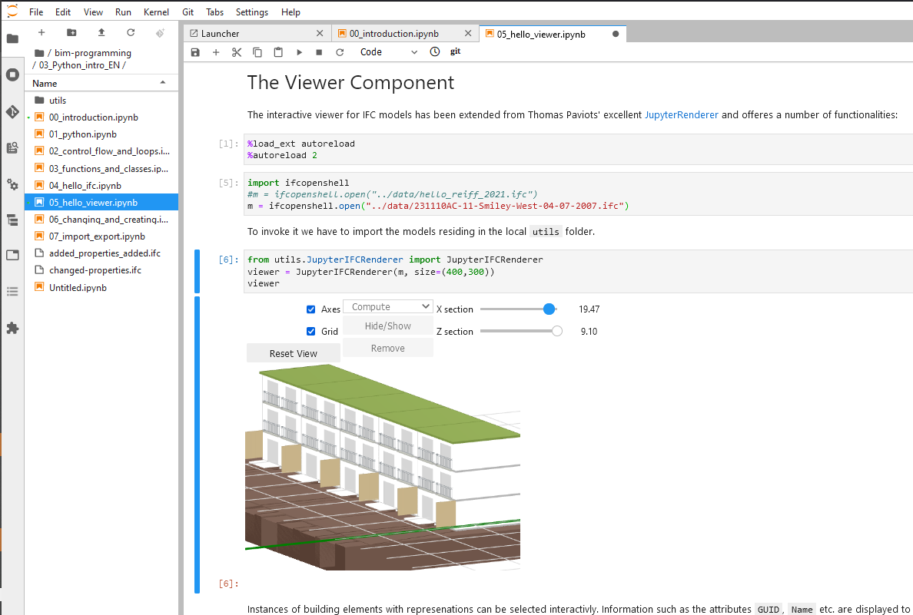
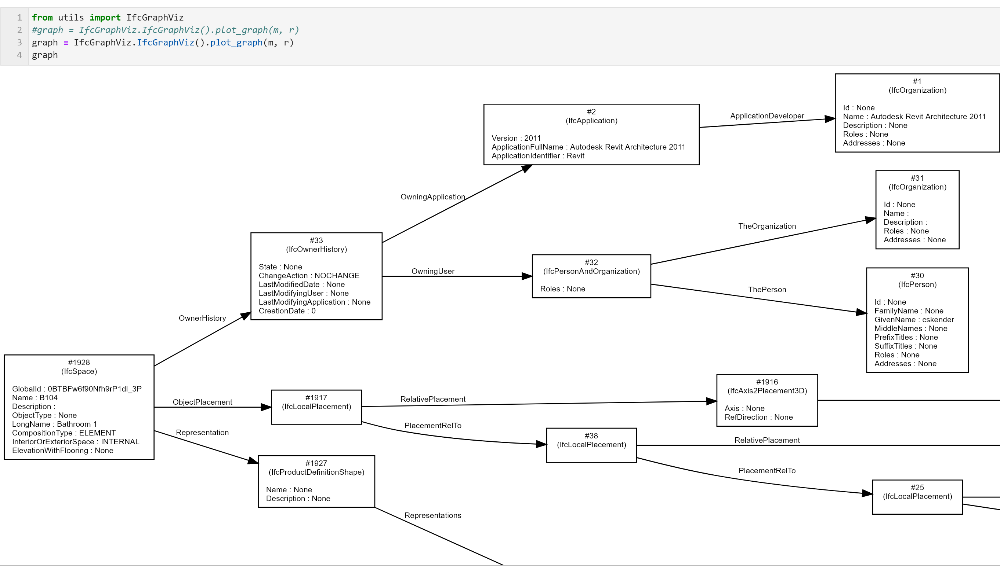
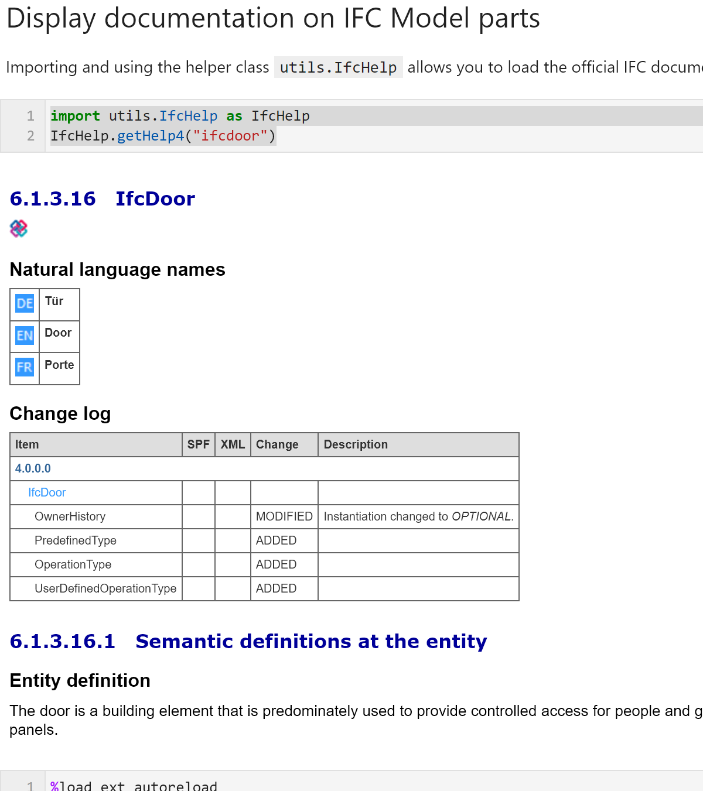

# ifcopenshell-notebooks
Interactive Jupyter Notebooks to teach working with IFC files using ifcopenshell with python.

These Notebooks are part of mandatory classes for Bachelor students of [Architecture at the RWTH Aachen University](https://arch.rwth-aachen.de/go/id/gfa/) and have advanced versions for MSc levels. The notebooks usually run on the [Jupyter Hub of the RWTH Aachen](https://jupyter.rwth-aachen.de) but can be run on other Jupyter Notebook VMs.
They are published as [Open Educational Resources](https://en.unesco.org/themes/building-knowledge-societies/oer) 

To run the notebooks interactively, click the binder link above, a few seconds patience and you will be able to enjoy:
- Integrated IFC Viewer with bidirectional ability to 
  - select from script, get selection from mouse to script
  - see attributes of building element instances 
  - set visibility, colors and transparancy from script
- display model structure using GraphViz Dot

- Browse IFC 2x3 and IFC 4 documentation right in your notebook `IfcHelp.getHelp3("IfcDoor")` 

- use pandas, numpy etc. to do calculations on models
- reach through to the powerfull OpenCascadeKernel

If you like the work, please
- cite it, please use this DOI 
- sponsor [aothms](https://github.com/aothms) and [tpaviot](https://github.com/tpaviot/) whose great work this is based upon
- write s.th. into the forum, add a pull request
- help improve it!
- come to RWTH to study with us!
- more ideas are welcome
